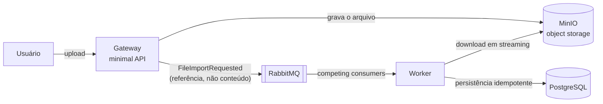

# async-import-service

Importação assíncrona de arquivos de grande volume. Inspirado num sistema real em que o processamento **síncrono** carregava o Excel inteiro em memória durante o request e derrubava o servidor web. Esta versão conserta o problema com mensageria, object storage e streaming.

## Arquitetura



O arquivo vai para o object storage; a mensagem carrega **só a referência** (padrão *Claim Check*). O broker distribui trabalho entre workers concorrentes (*work queue*), com ack manual e DLQ.

## Stack

| Peça | Papel | Por quê |
|---|---|---|
| .NET 10 | runtime dos serviços | LTS atual |
| RabbitMQ 4 | broker | o problema é distribuição de trabalho, não replay de eventos — work queue vence event log |
| PostgreSQL 17 | ledger transacional | dados importados com idempotência |
| MinIO | object storage S3-compatível | Claim Check; mapeável para S3 real |
| OpenTelemetry | traces/métricas/logs | fase 3 |
| Docker / K8s + KEDA | execução e autoscaling por profundidade de fila | fase 4 |
| DynamoDB (LocalStack) | status de job com TTL | fase 5 |
| xUnit + Testcontainers | testes unitários e de integração | desde a fase 1 |

## Fases

- [x] **0 — Fundação**: solution, docker-compose (RabbitMQ + Postgres + MinIO), contrato da mensagem
- [x] **1 — MVP ponta a ponta**: upload → storage → publish → consume → parse → Postgres, com idempotência, ack manual e entidade de job mínima
- [ ] **2 — Endurecimento**: streaming-parse (com medição de memória antes/depois), DLQ com retry, roteamento por tipo, endpoint de status, publisher confirms
- [ ] **3 — Observabilidade**: OTel com propagação de contexto através do broker, métricas de fila/lag/memória
- [ ] **4 — Docker multi-stage, Kubernetes, KEDA**
- [ ] **5 — DynamoDB via LocalStack** (status de job com TTL)
- [ ] **6 — Polimento**: README completo com justificativas, CI no GitHub Actions

## Infraestrutura local

```bash
docker compose up -d
```

| Serviço | Endpoint | Credenciais |
|---|---|---|
| RabbitMQ (AMQP) | `localhost:5672` | guest / guest |
| RabbitMQ (UI) | http://localhost:15672 | guest / guest |
| PostgreSQL | `localhost:5432` | import / import — db `importdb` |
| MinIO (S3 API) | http://localhost:9000 | minioadmin / minioadmin |
| MinIO (console) | http://localhost:9001 | minioadmin / minioadmin |
