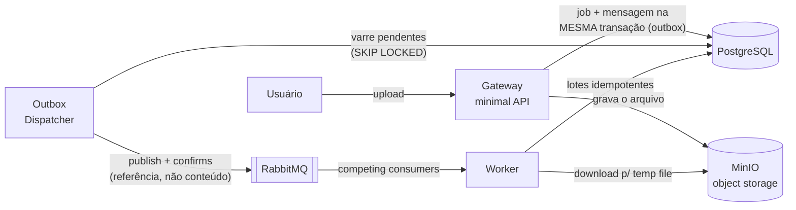

# async-import-service

[](https://github.com/LeonardoBalestere/async-import-service/actions/workflows/ci.yml)

Importação assíncrona de arquivos de grande volume. Inspirado num sistema real em que o processamento **síncrono** carregava o Excel inteiro em memória durante o request e derrubava o servidor web. Esta versão conserta o problema com mensageria, object storage e streaming.

## Arquitetura



O arquivo vai para o object storage; a mensagem carrega **só a referência** (padrão *Claim Check*) e nasce na **mesma transação** que o job (*transactional outbox* — o Gateway aceita uploads mesmo com o broker fora do ar). O broker distribui trabalho entre workers concorrentes (*work queue*), com ack manual, retry com espera e DLQ.

### O conserto, medido

O mesmo arquivo de **300 mil linhas**, na mesma máquina:

| Métrica do worker | Fase 1 (ClosedXML, tudo em memória) | Fase 2 (ExcelDataReader, streaming + lotes) |
|---|---|---|
| Pico de memória | **1.148 MB** | **203 MB** (5,7× menor) |
| Duração | 54 s | 47 s |
| Em repouso | 49 MB | 47 MB |

### Fluxo de falha (retry + DLQ)

```
file-imports ──nack──► imports.retry ──► file-imports.retry (TTL 5s)
                                              │ expira
file-imports ◄────────────────────────────────┘
   │ após 3 tentativas (contadas pelo broker via x-death)
   └──► file-imports.dlq (parking lot) + job marcado como Failed
```

A falha transitória se resolve sozinha; a permanente estaciona na DLQ com o payload intacto para diagnóstico, e o ledger (`ImportJobs`) guarda o motivo.

### Observabilidade

Um upload gera **um único trace** com ~17 spans atravessando os dois serviços:

```
POST /imports (gateway)
├── INSERT job + outbox (Npgsql)
├── PUT arquivo no MinIO (HTTP)
└── outbox dispatch                  ← contexto restaurado do TraceParent persistido
    └── publish file.xlsx           ← client injeta traceparent no header AMQP
        └── deliver file.xlsx (worker)
            └── import process       ← extração manual do header W3C
                ├── GET arquivo do MinIO
                └── inserts em lote (Npgsql)
```

Duas fronteiras que normalmente quebram o trace são costuradas explicitamente: a **outbox** (o `TraceParent` é persistido na linha e restaurado pelo dispatcher) e o **broker** (header W3C `traceparent` na mensagem AMQP).

Métricas: `rabbitmq.queue.depth` por fila (o sinal que o KEDA usará na Fase 4), `import.rows`, `import.duration`, e métricas de runtime (GC/heap — a história da Fase 2 virou dashboard). Logs dos dois serviços vão ao Loki via OTLP. Tudo em http://localhost:3000 (Grafana, anônimo).

### Kubernetes + KEDA

Imagens **multi-stage** (SDK → `noble-chiseled`: sem shell, non-root, ~170-195 MB) publicadas no GHCR; manifests em [k8s/](k8s/) com RabbitMQ, Postgres (PVC), MinIO (PVC), Gateway, Worker e o ScaledObject do KEDA. O limite de memória do worker (512Mi) **só é viável por causa do streaming da Fase 2** — o parser ingênuo de 1.148 MB seria OOMKilled.

```bash
kind create cluster --name import
kubectl apply --server-side -f https://github.com/kedacore/keda/releases/download/v2.20.1/keda-2.20.1.yaml
kubectl apply -f k8s/namespace.yaml
kubectl create secret docker-registry ghcr-pull -n import-service \
  --docker-server=ghcr.io --docker-username=<user> --docker-password=<token com read:packages>
kubectl apply -f k8s/
kubectl port-forward svc/import-gateway 5080:8080 -n import-service
```

Demo medida do autoscaling (3 uploads de ~300k linhas com a fila vazia e **zero workers**):

| t | evento |
|---|---|
| 0s | 3 uploads; fila com 3 mensagens; 0 workers |
| 8s | KEDA acorda o 1º worker |
| 11,5s | 2º worker (o KEDA conta mensagens *ready* — a que o 1º worker já puxou, não-ackada, sai da conta) |
| ~50s | 840 mil linhas persistidas, fila vazia |
| 111s | cooldown de 60s vencido → **0 workers** |

Dev-grade declarado: infra stateful em Deployment simples com credenciais em env var. Em produção: RabbitMQ Cluster Operator, CloudNativePG (ou banco gerenciado), Secrets externos, e o Grafana/LGTM — que aqui ficou fora do cluster de propósito, no papel de observabilidade gerenciada.

### Status de job no DynamoDB (LocalStack)

Status de polling é key-value efêmero: leitura por chave em alta frequência, escrita pequena a cada transição, ninguém liga depois de uns dias. Modelagem (tabela `import-job-status`):

```
pk = jobId | sk = "LATEST"            → sobrescrito a cada transição (GetItem)
pk = jobId | sk = "EVENT#<timestamp>" → histórico ordenado pela própria chave (Query)
```

- `GET /imports/{id}` lê o DynamoDB (`source: status-store`); item expirado ou ausente → **fallback pro ledger Postgres** (`source: ledger`), que nunca esquece.
- `GET /imports/{id}/timeline` devolve as transições (`Received → Processing → Completed`, com tentativa e erro nas falhas).
- **Dual-write aceito e documentado**: status é derivado e efêmero — se a escrita no Dynamo falhar, o pior caso é a view atrasar; o ledger corrige na leitura.
- **TTL é limpeza, não contrato**: no DynamoDB real a remoção acontece em até ~48h após expirar. A leitura filtra `expiresAt` client-side — demonstrado com TTL de 8s: em T+12s a API já respondia pelo ledger com o item ainda fisicamente presente.
- LocalStack fixado em `localstack/localstack:4` — a última linha community (Apache 2.0); a `latest` de 2026 exige licença.

## Stack

| Peça | Papel | Por quê |
|---|---|---|
| .NET 10 | runtime dos serviços | LTS atual |
| RabbitMQ 4 | broker | o problema é distribuição de trabalho, não replay de eventos — work queue vence event log |
| PostgreSQL 17 | ledger transacional | dados importados com idempotência |
| MinIO | object storage S3-compatível | Claim Check; mapeável para S3 real |
| OpenTelemetry | traces/métricas/logs | um único trace cobre upload → outbox → broker → worker → SQL |
| Grafana LGTM (Tempo/Mimir/Loki) | backend de observabilidade | mesmo stack de produção, recebendo OTLP |
| Docker / K8s + KEDA | execução e autoscaling por profundidade de fila | fase 4 |
| DynamoDB (LocalStack) | status de job com TTL | fase 5 |
| xUnit + Testcontainers | testes unitários e de integração | integração roda contra Postgres e LocalStack REAIS |

## Fases

- [x] **0 — Fundação**: solution, docker-compose (RabbitMQ + Postgres + MinIO), contrato da mensagem
- [x] **1 — MVP ponta a ponta**: upload → storage → publish → consume → parse → Postgres, com idempotência, ack manual e entidade de job mínima
- [x] **2 — Endurecimento**: streaming-parse (medido: 1.148 → 203 MB), retry com TTL + DLQ, roteamento por tipo via exchange, outbox transacional com publisher confirms
- [x] **3 — Observabilidade**: OTel com trace atravessando outbox e broker (17 spans num upload), métricas de fila/negócio/runtime e logs no Grafana LGTM
- [x] **4 — Docker multi-stage, Kubernetes, KEDA**: imagens chiseled no GHCR, manifests completos (infra + app), worker escalando 0→N→0 por profundidade de fila
- [x] **5 — DynamoDB via LocalStack**: status de job como item collection (LATEST + eventos) com TTL e fallback pro ledger
- [x] **6 — Polimento**: testes de integração com Testcontainers, CI no GitHub Actions publicando as imagens no GHCR, README final

## Infraestrutura local

```bash
docker compose up -d
```

| Serviço | Endpoint | Credenciais |
|---|---|---|
| RabbitMQ (AMQP) | `localhost:5672` | guest / guest |
| RabbitMQ (UI) | http://localhost:15672 | guest / guest |
| PostgreSQL | `localhost:5432` | import / import — db `importdb` |
| MinIO (S3 API) | http://localhost:9000 | minioadmin / minioadmin |
| MinIO (console) | http://localhost:9001 | minioadmin / minioadmin |
| LocalStack (DynamoDB) | http://localhost:4566 | test / test |
| Grafana | http://localhost:3000 | anônimo |

### Rodando os serviços e os testes

```bash
dotnet run --project src/ImportService.Gateway   # API em http://localhost:5080 (--urls)
dotnet run --project src/ImportService.Worker

dotnet test   # unitários + integração (Testcontainers: precisa de Docker rodando)
```

O CI (GitHub Actions) compila, roda todos os testes e — em `main` — publica as
imagens no GHCR usando o `GITHUB_TOKEN` nativo (que já nasce com `packages: write`).

## Decisões e trade-offs

| Decisão | Escolha | Por quê | Quando a alternativa venceria |
|---|---|---|---|
| Broker | RabbitMQ (work queue) | o problema é distribuição de trabalho com ack por item | Kafka, se precisasse de replay/event log |
| Payload da mensagem | Claim Check (referência) | mensagem de ~300 bytes; broker não é storage | payload embutido, só pra eventos minúsculos |
| Publicação | Outbox transacional + confirms | elimina o dual-write causativo; upload funciona com broker morto | publish direto, se perder mensagem fosse tolerável |
| Retry | Fila TTL + DLX, x-death, parking-lot | broker carrega o estado; worker stateless | Polly in-process, se a espera fosse de milissegundos |
| Parse | ExcelDataReader streaming + lotes | 1.148 MB → 203 MB medidos no mesmo arquivo | ClosedXML, se precisasse de acesso aleatório a células |
| Persistência bulk | EF em lotes + ChangeTracker.Clear | suficiente e legível; 300k linhas em ~40s | COPY binário do Npgsql, para milhões de linhas |
| Status de job | DynamoDB com TTL + fallback ledger | key-value efêmero de alta frequência; expira sozinho | só Postgres, em volume baixo; Redis, se TTL real importasse |
| Imagens | Multi-stage → chiseled non-root | 171-195 MB, sem shell, superfície mínima | imagem cheia, se debugar com exec fosse rotina |
| Autoscaling | KEDA por profundidade de fila | o sinal certo pra worker de fila é backlog, não CPU | HPA por CPU, para serviços request/response |

## Evoluções conhecidas (dívidas declaradas)

- **Shutdown gracioso do worker**: hoje o scale-in reenfileira a mensagem em voo (seguro por idempotência); o refinamento é drenar antes de morrer.
- **Purga da outbox**: linhas despachadas acumulam — um job periódico de limpeza (ou TTL por partição) resolve.
- **Backoff exponencial**: a fila de retry tem espera fixa; degraus exigiriam uma fila por atraso ou o plugin de delayed exchange.
- **GSI por status no DynamoDB**: "todos os jobs Failed" não existe sem índice secundário.
- **Infra stateful com operators** (RabbitMQ Cluster Operator, CloudNativePG) e Secrets de verdade nos manifests.
- **SignalR** para push de status em tempo real, no lugar do polling.
