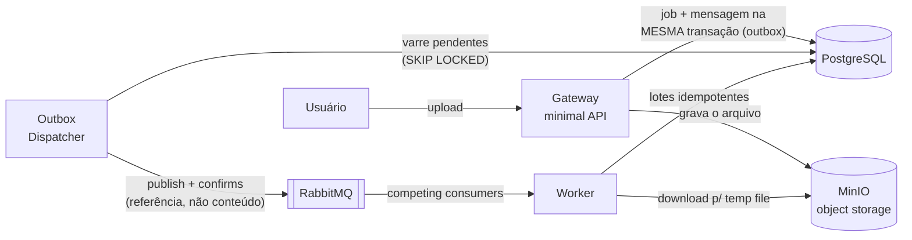

# async-import-service

Importação assíncrona de arquivos de grande volume. Inspirado num sistema real em que o processamento **síncrono** carregava o Excel inteiro em memória durante o request e derrubava o servidor web. Esta versão conserta o problema com mensageria, object storage e streaming.

## Arquitetura



O arquivo vai para o object storage; a mensagem carrega **só a referência** (padrão *Claim Check*) e nasce na **mesma transação** que o job (*transactional outbox* — o Gateway aceita uploads mesmo com o broker fora do ar). O broker distribui trabalho entre workers concorrentes (*work queue*), com ack manual, retry com espera e DLQ.

### O conserto, medido

O mesmo arquivo de **300 mil linhas**, na mesma máquina:

| Métrica do worker | Fase 1 (ClosedXML, tudo em memória) | Fase 2 (ExcelDataReader, streaming + lotes) |
|---|---|---|
| Pico de memória | **1.148 MB** | **203 MB** (5,7× menor) |
| Duração | 54 s | 47 s |
| Em repouso | 49 MB | 47 MB |

### Fluxo de falha (retry + DLQ)

```
file-imports ──nack──► imports.retry ──► file-imports.retry (TTL 5s)
                                              │ expira
file-imports ◄────────────────────────────────┘
   │ após 3 tentativas (contadas pelo broker via x-death)
   └──► file-imports.dlq (parking lot) + job marcado como Failed
```

A falha transitória se resolve sozinha; a permanente estaciona na DLQ com o payload intacto para diagnóstico, e o ledger (`ImportJobs`) guarda o motivo.

### Observabilidade

Um upload gera **um único trace** com ~17 spans atravessando os dois serviços:

```
POST /imports (gateway)
├── INSERT job + outbox (Npgsql)
├── PUT arquivo no MinIO (HTTP)
└── outbox dispatch                  ← contexto restaurado do TraceParent persistido
    └── publish file.xlsx           ← client injeta traceparent no header AMQP
        └── deliver file.xlsx (worker)
            └── import process       ← extração manual do header W3C
                ├── GET arquivo do MinIO
                └── inserts em lote (Npgsql)
```

Duas fronteiras que normalmente quebram o trace são costuradas explicitamente: a **outbox** (o `TraceParent` é persistido na linha e restaurado pelo dispatcher) e o **broker** (header W3C `traceparent` na mensagem AMQP).

Métricas: `rabbitmq.queue.depth` por fila (o sinal que o KEDA usará na Fase 4), `import.rows`, `import.duration`, e métricas de runtime (GC/heap — a história da Fase 2 virou dashboard). Logs dos dois serviços vão ao Loki via OTLP. Tudo em http://localhost:3000 (Grafana, anônimo).

## Stack

| Peça | Papel | Por quê |
|---|---|---|
| .NET 10 | runtime dos serviços | LTS atual |
| RabbitMQ 4 | broker | o problema é distribuição de trabalho, não replay de eventos — work queue vence event log |
| PostgreSQL 17 | ledger transacional | dados importados com idempotência |
| MinIO | object storage S3-compatível | Claim Check; mapeável para S3 real |
| OpenTelemetry | traces/métricas/logs | um único trace cobre upload → outbox → broker → worker → SQL |
| Grafana LGTM (Tempo/Mimir/Loki) | backend de observabilidade | mesmo stack de produção, recebendo OTLP |
| Docker / K8s + KEDA | execução e autoscaling por profundidade de fila | fase 4 |
| DynamoDB (LocalStack) | status de job com TTL | fase 5 |
| xUnit + Testcontainers | testes unitários e de integração | desde a fase 1 |

## Fases

- [x] **0 — Fundação**: solution, docker-compose (RabbitMQ + Postgres + MinIO), contrato da mensagem
- [x] **1 — MVP ponta a ponta**: upload → storage → publish → consume → parse → Postgres, com idempotência, ack manual e entidade de job mínima
- [x] **2 — Endurecimento**: streaming-parse (medido: 1.148 → 203 MB), retry com TTL + DLQ, roteamento por tipo via exchange, outbox transacional com publisher confirms
- [x] **3 — Observabilidade**: OTel com trace atravessando outbox e broker (17 spans num upload), métricas de fila/negócio/runtime e logs no Grafana LGTM
- [ ] **4 — Docker multi-stage, Kubernetes, KEDA**
- [ ] **5 — DynamoDB via LocalStack** (status de job com TTL)
- [ ] **6 — Polimento**: README completo com justificativas, CI no GitHub Actions

## Infraestrutura local

```bash
docker compose up -d
```

| Serviço | Endpoint | Credenciais |
|---|---|---|
| RabbitMQ (AMQP) | `localhost:5672` | guest / guest |
| RabbitMQ (UI) | http://localhost:15672 | guest / guest |
| PostgreSQL | `localhost:5432` | import / import — db `importdb` |
| MinIO (S3 API) | http://localhost:9000 | minioadmin / minioadmin |
| MinIO (console) | http://localhost:9001 | minioadmin / minioadmin |
